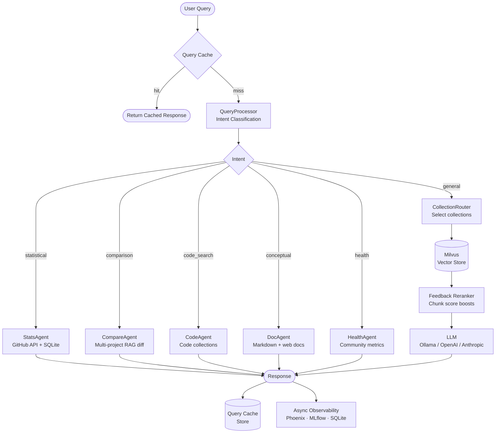
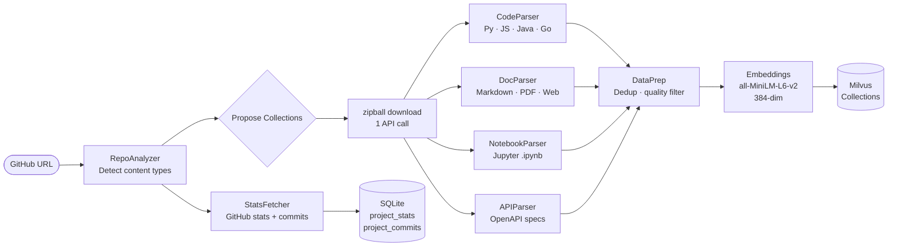
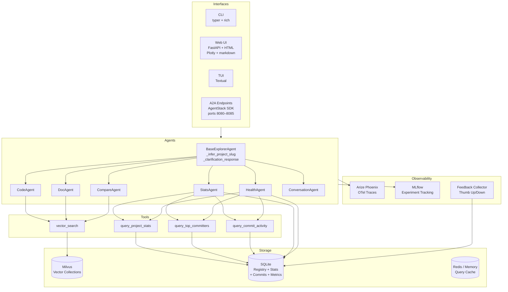
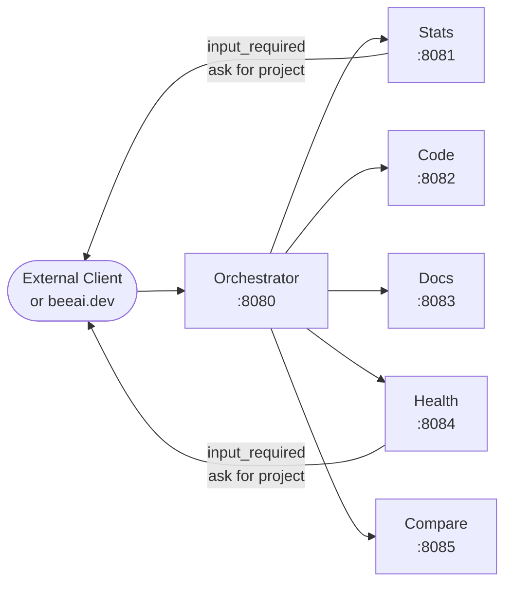

# Project Explorer

A production-quality multi-agent RAG reference implementation for exploring and understanding GitHub repositories through natural language.

Built on open-source components from the LF AI & Data Foundation ecosystem.

## What it does

Point it at any GitHub repository and ask questions in plain English:

```
project-explorer add https://github.com/apache/arrow
project-explorer ask --project arrow "How does the Flight RPC protocol work?"
project-explorer ask --project arrow "Who are the most active contributors in the last 90 days?"
project-explorer chat --project arrow
project-explorer web   # browser UI with Plotly charts and markdown rendering
```

It classifies your question, routes it to the right agent (code search, documentation, statistics, health), retrieves relevant context from Milvus, and synthesizes an answer with an LLM.

---

## Architecture

### Query Flow



### Ingestion Pipeline



### Multi-Agent System



### A2A Agent Endpoints (AgentStack)



Each agent is individually discoverable. Stats and Health use the A2A `input_required` pattern — if the project cannot be inferred from the query, the agent pauses and asks the user, then resumes when the reply arrives.

---

## Tech Stack

| Component | Package | Notes |
|---|---|---|
| Agent framework | `beeai-framework[rag]` | `RequirementAgent` with `@tool`-decorated functions |
| Agent runtime | `agentstack-sdk` | A2A server, one `Server` instance per agent |
| Vector store | `pymilvus` | Multi-tenant via collection namespacing |
| Document parsing | `docling` | PDF, web, DOCX, Markdown |
| Embeddings | `sentence-transformers` | `all-MiniLM-L6-v2`, 384-dim, MPS on Apple Silicon |
| LLM default | `ollama` | Metal GPU on Apple Silicon; pluggable |
| LLM tracing | `openinference-instrumentation-beeai` | → Arize Phoenix at localhost:6006 |
| Experiment tracking | `mlflow` | Background thread, non-blocking |
| CLI | `typer` + `rich` | |
| Web UI | `fastapi` + `uvicorn` + Tailwind + Plotly.js | Full-page HTML frontend |
| TUI | `textual` | Full-screen terminal UI |

---

## Setup

```bash
# Install uv
curl -LsSf https://astral.sh/uv/install.sh | sh

# Install dependencies
uv sync --extra dev --extra phoenix

# Configure environment
cp .env.example .env
# Edit .env: set GITHUB_TOKEN, MILVUS_URI, LLM_BACKEND
```

### External services

| Service | Default | Required |
|---|---|---|
| Milvus | `localhost:19530` | Yes |
| Ollama | `localhost:11434` | Yes (default LLM) |
| Arize Phoenix | `localhost:6006` | Optional — traces |
| MLflow | `localhost:5025` | Optional — experiments |

```bash
# Start Milvus (Docker)
docker run -d --name milvus-standalone \
  -p 19530:19530 -p 9091:9091 \
  milvusdb/milvus:latest standalone

# Pull a model for Ollama
ollama pull llama3.1:8b

# Optional: start Phoenix
python -m phoenix.server.main

# Optional: start MLflow
mlflow server --port 5025
```

---

## Commands

```bash
# Add a GitHub project (interactive wizard)
project-explorer add https://github.com/owner/repo

# Add without prompts
project-explorer add https://github.com/owner/repo --yes

# List all projects with collection names and vector counts
project-explorer list

# Show full per-collection detail
project-explorer list --details

# Ask a one-shot question
project-explorer ask "How does authentication work?"

# Scope to a specific project
project-explorer ask --project myproject "What are the main CLI commands?"

# Interactive multi-turn chat
project-explorer chat --project myproject

# Incrementally re-index and refresh statistics
project-explorer refresh myproject

# Skip statistics update during refresh
project-explorer refresh myproject --no-stats

# Attach a documentation site to an existing project
project-explorer add-docs myproject --docs-url https://docs.myproject.io

# Show environment health (services, projects, collection counts)
project-explorer status

# Launch full-screen TUI
project-explorer tui

# Launch browser-based web UI (Plotly charts + markdown rendering)
project-explorer web
project-explorer web --host 0.0.0.0 --port 8080
project-explorer web --reload   # dev mode

# Start AgentStack A2A orchestrator (single agent, port 8080)
project-explorer serve

# Start all 6 specialist agents on consecutive ports (8080–8085)
project-explorer serve --all

# Remove a project and all its data
project-explorer remove myproject
```

---

## Interfaces

### Web UI

`project-explorer web` starts a FastAPI server and opens `http://127.0.0.1:8000` in your browser.

- **Left sidebar** — project list with status indicators; click a project to scope all queries to it
- **Chat area** — markdown-rendered responses with 👍/👎 feedback buttons on each message
- **Charts** — Plotly.js charts (Stars, Commits, Languages, Health) rendered per selected project
- **Clarification flow** — if the agent needs a project name, the response prompts you; click a project in the sidebar or type its name to re-run your original question

### TUI

`project-explorer tui` launches a full-screen Textual application.

- `Tab` — move focus between sidebar and chat input
- `f` — open feedback prompt for the last response (press `y`/`n`)
- `r` — refresh the selected project's index
- **Clarification flow** — select a project from the sidebar or type its slug when prompted; the original query reruns automatically

### A2A Endpoints

`project-explorer serve --all` starts six independently discoverable agents:

| Port | Agent | Skill IDs |
|---|---|---|
| 8080 | Orchestrator | stats, code_search, documentation, health, compare, general |
| 8081 | Statistics | project_stats, top_committers, commit_activity |
| 8082 | Code Search | code_search, usage_examples |
| 8083 | Documentation | conceptual_qa, api_reference |
| 8084 | Health | health_score, pr_metrics |
| 8085 | Compare | project_comparison |

---

## Collection Types

Each project gets its own namespaced collections: `{project_slug}_{collection_type}`

| Type | Content | Chunk Size |
|---|---|---|
| `python_code` | `.py` source files | 512 tokens |
| `javascript_code` | `.js` / `.ts` files | 512 tokens |
| `java_code` | `.java` files | 512 tokens |
| `go_code` | `.go` files | 512 tokens |
| `markdown_docs` | READMEs, guides | 384 tokens |
| `web_docs` | MkDocs, Sphinx, Docusaurus | 384 tokens |
| `api_reference` | OpenAPI specs, docstrings | 256 tokens |
| `examples` | Code samples, notebooks | 1024 tokens |
| `pdfs` | PDFs via Docling | 512 tokens |
| `release_notes` | Changelogs, release bodies | 256 tokens |

Not every project gets every collection — `RepoAnalyzer` inspects the repo and proposes which to create based on what's present.

---

## Query Intent Classification

The system classifies each query before touching the vector store:

| Intent | Trigger keywords | Agent |
|---|---|---|
| `statistical` | stars, commits, contributors, releases, LOC, committers, top committers | `StatsAgent` |
| `comparison` | compare, vs, difference between | `CompareAgent` |
| `code_search` | function, class, method, implementation | `CodeAgent` |
| `conceptual` | how does, what is, explain, architecture | `DocAgent` |
| `health` | active, maintained, community, health, bus factor | `HealthAgent` |
| `general` | everything else | RAG pipeline |

Statistical and health queries never hit Milvus — they read directly from the SQLite metrics store and GitHub API.

---

## Feedback Reranking

Every query response includes a thumbs-up/down prompt. Feedback is used to boost or penalize chunk scores in future retrievals:

```
boost = (precision - 0.5) × confidence × 0.3
```

where `precision = positive_votes / total_votes` and `confidence = min(votes / 5, 1.0)`.

A chunk needs at least 5 votes for full weight, and a 100% approval rate adds +0.15 to its cosine similarity score.

---

## Commit Trend Analysis

`project-explorer refresh` always fetches the last 90 days of commits into a `project_commits` SQLite table (unless `--no-stats` is passed). Statistical queries can then answer:

- Who are the most active contributors?
- How has commit activity trended week-over-week?
- When was the last commit?

---

## Development

```bash
# Run tests
uv run pytest tests/ -v

# With coverage
uv run pytest --cov=explorer --cov-report=html

# End-to-end smoke test
uv run python scripts/test_end_to_end.py --quick

# Code style
uv run black explorer/
uv run ruff check explorer/
uv run mypy explorer/
```

---

## Module Map

```
explorer/
├── config.py                  # Pydantic settings
├── registry.py                # Project registry (SQLite: projects, project_stats, project_commits)
├── rag_system.py              # Main query orchestrator
├── query_processor.py         # Intent classifier (routing.yaml patterns)
├── collection_router.py       # Collection selector
├── query_cache.py             # LRU cache (memory or Redis)
├── llm_client.py              # LLM backend protocol
├── embeddings.py              # SentenceTransformer wrapper
├── multi_collection_store.py  # Milvus operations + feedback reranking
├── prompt_templates.py        # Per-agent prompts
├── agentstack_server.py       # AgentStack A2A server (6 agents, ports 8080–8085)
├── github/
│   ├── client.py              # GitHub API wrapper
│   ├── analyzer.py            # Repo content analyzer
│   └── stats_fetcher.py       # Stats + 90-day commit history → SQLite
├── ingestion/
│   ├── pipeline.py            # Full ingestion orchestrator
│   ├── incremental.py         # Commit-diff based updates
│   ├── code_parser.py         # Language parsers
│   ├── doc_parser.py          # Markdown + Docling
│   ├── notebook_parser.py     # Jupyter .ipynb
│   ├── api_parser.py          # OpenAPI / Swagger
│   └── data_prep.py           # Quality filtering + dedup
├── agents/
│   ├── base.py                # BaseExplorerAgent (_infer_project_slug, _clarification_response)
│   ├── tools.py               # BeeAI @tool functions (vector_search, query_project_stats, ...)
│   ├── code_agent.py          # Code search (uses vector_search tool)
│   ├── doc_agent.py           # Documentation Q&A (uses vector_search tool)
│   ├── stats_agent.py         # GitHub statistics + commit trends (uses stats tools)
│   ├── compare_agent.py       # Multi-project comparison
│   ├── health_agent.py        # Community health scoring (uses stats tools)
│   └── conversation_agent.py  # Multi-turn session
├── cli/
│   ├── main.py                # Typer CLI entry points (add, list, ask, chat, refresh, web, serve, tui, ...)
│   ├── interactive.py         # REPL loop
│   ├── wizard.py              # Add-project wizard
│   └── formatters.py          # Rich output helpers
├── web/
│   ├── app.py                 # FastAPI application
│   ├── static/
│   │   └── index.html         # Single-page UI (Tailwind, Plotly.js, marked.js)
│   └── routes/
│       ├── query.py           # POST /api/query/, POST /api/query/feedback
│       ├── projects.py        # GET /api/projects/
│       └── stats.py           # GET /api/stats/{slug}/charts/{type}
├── tui/
│   └── app.py                 # Textual full-screen TUI (clarification-aware)
├── dashboard/
│   ├── terminal_dashboard.py  # Rich Live dashboard
│   └── graphs.py              # Plotext + Plotly charts
└── observability/
    ├── metrics_collector.py   # SQLite query log + chunk feedback
    ├── phoenix_client.py      # Arize Phoenix / OpenTelemetry
    ├── mlflow_tracking.py     # MLflow experiment logging
    └── feedback_collector.py  # Thumbs up/down collection
```

---

## Inspired by

- [egeria-advisor](https://github.com/odpi/egeria-advisor) — original multi-agent RAG pattern
- [lfai/ML_LLM_Ops](https://github.com/lfai/ML_LLM_Ops) — LF AI & Data reference stack
