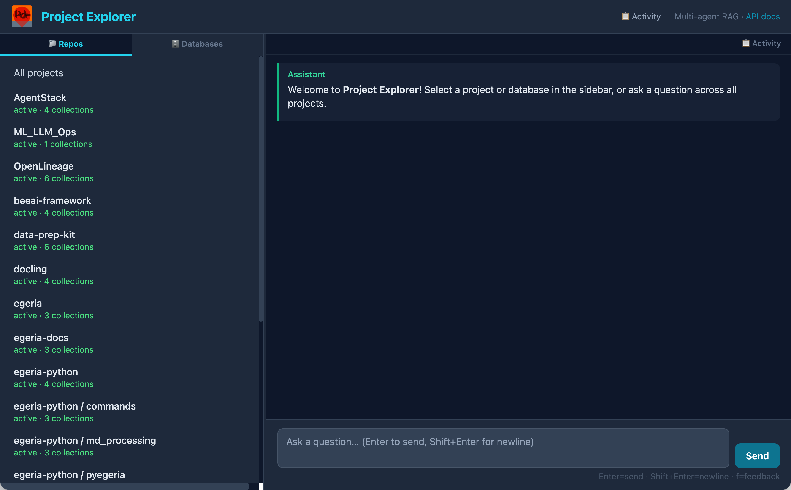
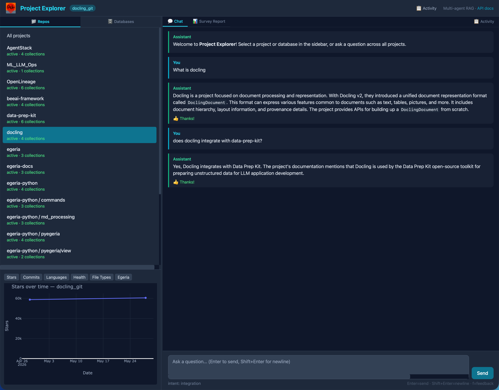
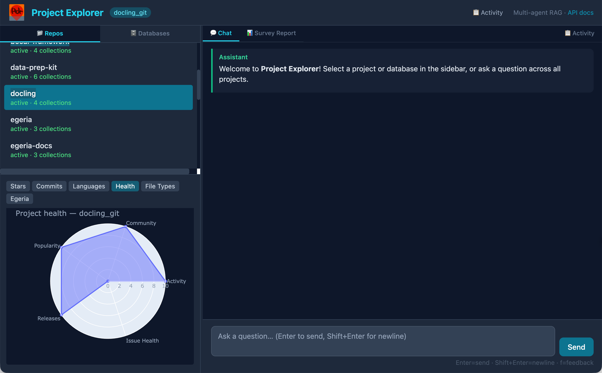
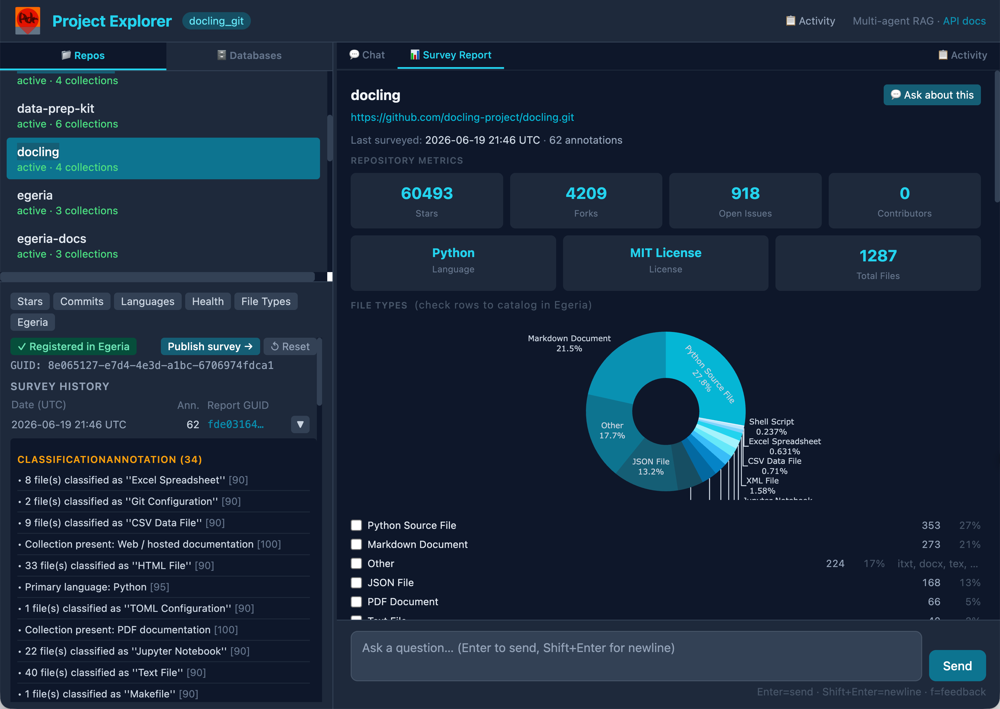
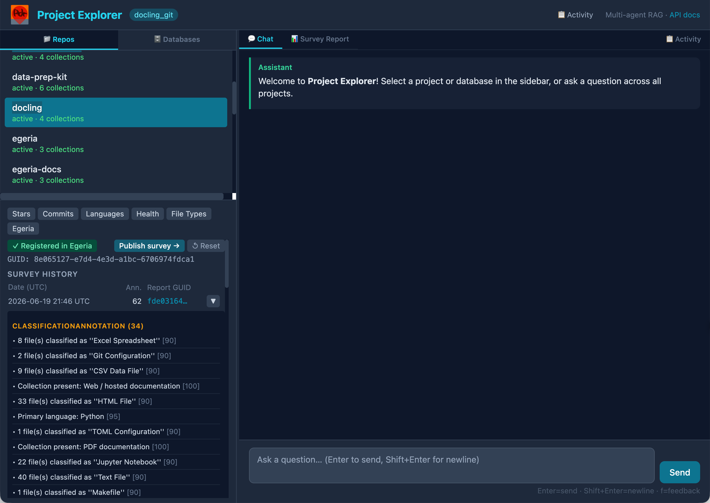
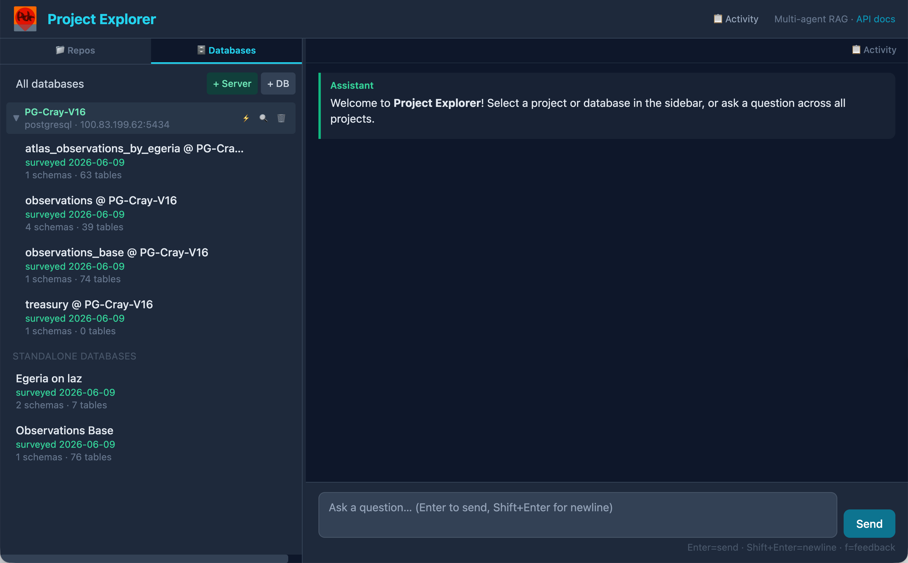
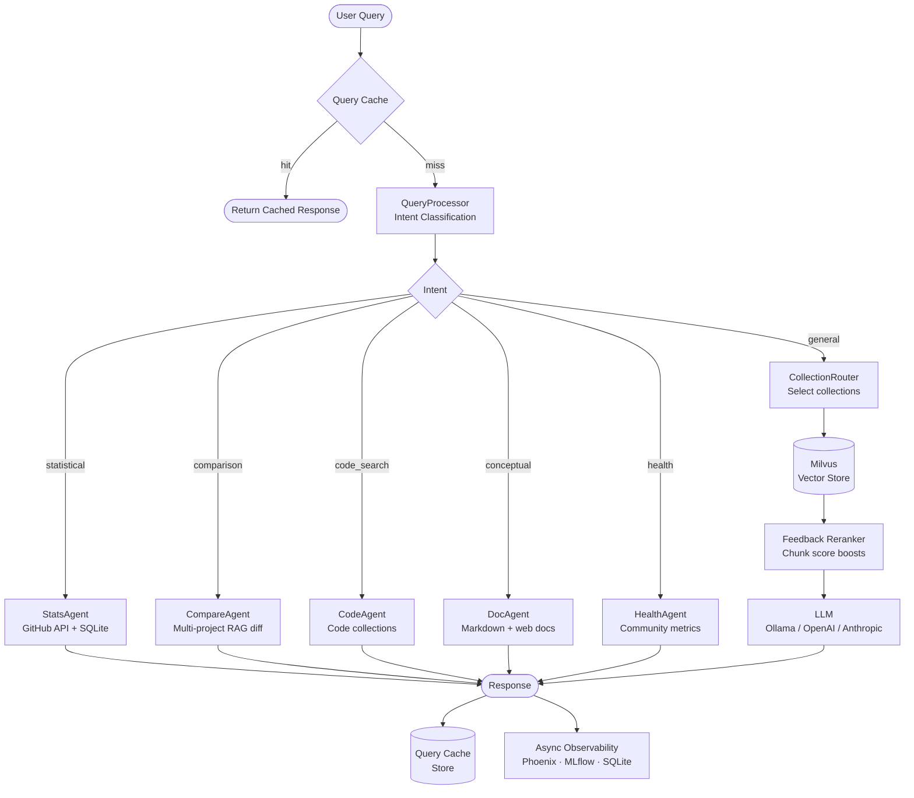
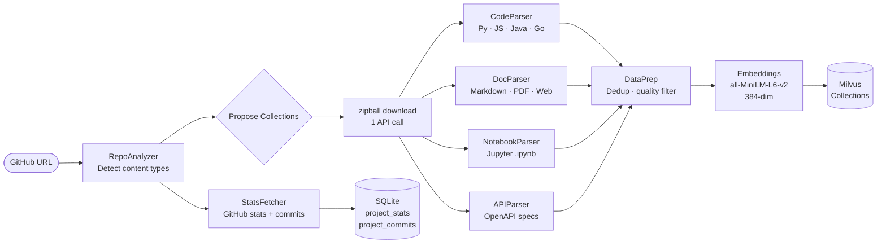
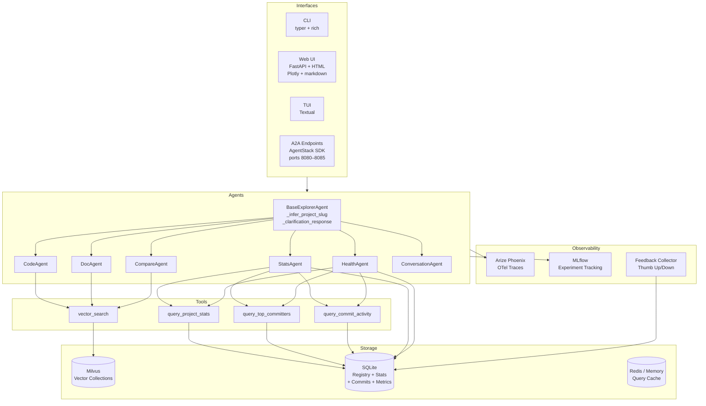
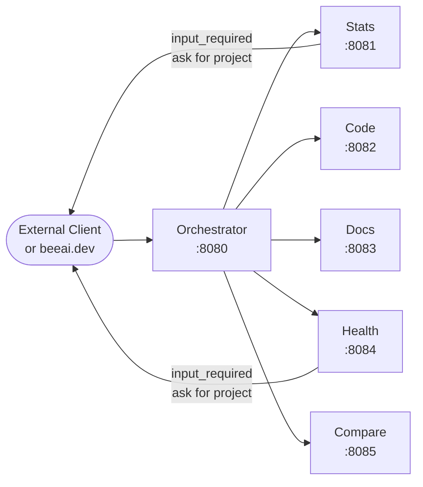

# Project Explorer

**Project Explorer turns GitHub repositories and databases into something you can simply talk to.**

Point it at a project — Apache Arrow, your own monorepo, a PostgreSQL server — and it
ingests the code, documentation, commit history, and schemas, then lets you explore
everything in plain English. It's a production-quality, multi-agent RAG reference
implementation built entirely on open-source components from the LF AI & Data Foundation
ecosystem (BeeAI, Milvus, Docling, Egeria, Ollama).

It's aimed at technical users and product managers who need to evaluate or understand a
project quickly — **no AI/ML expertise required.**



## What it can do

- **Ask questions about any repository.** Project Explorer classifies your intent and
  routes it to the right specialist agent — code search, documentation, statistics,
  health, or comparison — retrieves the relevant context from a vector store, and
  synthesizes a grounded answer. It cites sources and says "I don't know" rather than
  hallucinate.

  

- **See a project at a glance.** Live charts for stars, commit activity, languages,
  community health, and file-type breakdown, pulled from the GitHub API and a local
  time-series.

  

- **Survey a project like a data catalog.** The Egeria-aligned surveyor profiles the
  repository — file types, sizes, languages, dependencies, API structure, documentation
  hygiene, security posture, and data-file schemas — and produces an annotated survey
  report. No Egeria instance required to run it locally.

  

- **Catalog into Egeria.** Optionally publish surveys, annotations, and assets to an
  Egeria metadata server, then drill back into the annotations from the UI.

  

- **Discover and survey databases.** Register a PostgreSQL server, discover its
  databases, and survey their schemas, tables, columns, keys, and comments — locally or
  via Egeria's native database surveys.

  

Everything is available from a CLI, a full-screen TUI, or the browser-based web UI shown
above.

## Installation & Usage

### With uv (Recommended)

```bash
# Sync dependencies (from project root)
uv sync

# Run commands with uv run
uv run python -m explorer.cli.main database list
uv run python -m explorer.cli.main database register my-db postgresql localhost 5432 mydb
uv run python -m explorer.cli.main web
```

### With pip (Alternative)

```bash
# Install in editable mode
pip install -e .

# Then use the command directly
project-explorer database list
project-explorer web
```

## What it does

Point it at any GitHub repository or database and ask questions in plain English:

### GitHub Repositories
```bash
# With uv
uv run python -m explorer.cli.main add https://github.com/apache/arrow
uv run python -m explorer.cli.main ask --project arrow "How does the Flight RPC protocol work?"
uv run python -m explorer.cli.main chat --project arrow
uv run python -m explorer.cli.main web

# With pip install
project-explorer add https://github.com/apache/arrow
project-explorer ask --project arrow "How does the Flight RPC protocol work?"
project-explorer survey --project arrow
```

### Databases (NEW!)
```bash
# With uv
uv run python -m explorer.cli.main database register my-postgres postgresql localhost 5432 mydb
uv run python -m explorer.cli.main database survey my-postgres --egeria
uv run python -m explorer.cli.main database list
uv run python -m explorer.cli.main database info my-postgres

# With pip install
project-explorer database register my-postgres postgresql localhost 5432 mydb
project-explorer database survey my-postgres --egeria
project-explorer database list
```

**Note**: The `project-explorer` command is only available after `pip install -e .`. With `uv`, use `uv run python -m explorer.cli.main` instead.

It classifies your question, routes it to the right agent (code search, documentation, statistics, health, database schema), retrieves relevant context from Milvus, and synthesizes an answer with an LLM.

---

## Architecture

### Query Flow


```mermaid
flowchart TD
    A([User Query]) --> B{Query Cache}
    B -- hit --> Z([Return Cached Response])
    B -- miss --> C[QueryProcessor\nIntent Classification]

    C --> D{Intent}
    D -- statistical --> E[StatsAgent\nGitHub API + SQLite]
    D -- comparison --> F[CompareAgent\nMulti-project RAG diff]
    D -- code_search --> G[CodeAgent\nCode collections]
    D -- conceptual --> H[DocAgent\nMarkdown + web docs]
    D -- health --> I[HealthAgent\nCommunity metrics]
    D -- general --> J[CollectionRouter\nSelect collections]

    J --> K[(Milvus\nVector Store)]
    K --> L[Feedback Reranker\nChunk score boosts]
    L --> M[LLM\nOllama / OpenAI / Anthropic]

    E --> N([Response])
    F --> N
    G --> N
    H --> N
    I --> N
    M --> N

    N --> O[(Query Cache\nStore)]
    N --> P[Async Observability\nPhoenix · MLflow · SQLite]
```

### Ingestion Pipeline


```mermaid
flowchart LR
    A([GitHub URL]) --> B[RepoAnalyzer\nDetect content types]
    B --> C{Propose Collections}

    C --> D[zipball download\n1 API call]
    D --> E[CodeParser\nPy · JS · Java · Go]
    D --> F[DocParser\nMarkdown · PDF · Web]
    D --> G[NotebookParser\nJupyter .ipynb]
    D --> H[APIParser\nOpenAPI specs]

    E & F & G & H --> I[DataPrep\nDedup · quality filter]
    I --> J[Embeddings\nall-MiniLM-L6-v2\n384-dim]
    J --> K[(Milvus\nCollections)]

    B --> L[StatsFetcher\nGitHub stats + commits]
    L --> M[(SQLite\nproject_stats\nproject_commits)]
```

### Multi-Agent System


```mermaid
flowchart TB
    subgraph Interfaces
        CLI[CLI\ntyper + rich]
        Web[Web UI\nFastAPI + HTML\nPlotly + markdown]
        TUI[TUI\nTextual]
        A2A[A2A Endpoints\nAgentStack SDK\nports 8080–8085]
    end

    subgraph Agents
        Base[BaseExplorerAgent\n_infer_project_slug\n_clarification_response]
        Base --> Stats[StatsAgent]
        Base --> Compare[CompareAgent]
        Base --> Code[CodeAgent]
        Base --> Doc[DocAgent]
        Base --> Health[HealthAgent]
        Base --> Conv[ConversationAgent]
    end

    subgraph Tools
        T1[vector_search]
        T2[query_project_stats]
        T3[query_top_committers]
        T4[query_commit_activity]
    end

    subgraph Storage
        Milvus[(Milvus\nVector Collections)]
        SQLite[(SQLite\nRegistry + Stats\n+ Commits + Metrics)]
        Cache[(Redis / Memory\nQuery Cache)]
    end

    subgraph Observability
        Phoenix[Arize Phoenix\nOTel Traces]
        MLflow[MLflow\nExperiment Tracking]
        Feedback[Feedback Collector\nThumb Up/Down]
    end

    Interfaces --> Agents
    Stats & Health --> T2 & T3 & T4
    Code & Doc & Compare --> T1
    T1 --> Milvus
    T2 & T3 & T4 --> SQLite
    Stats & Health --> SQLite
    Agents --> Phoenix & MLflow
    Feedback --> SQLite
```

### A2A Agent Endpoints (AgentStack)


```mermaid
flowchart LR
    Client([External Client\nor beeai.dev]) --> O[Orchestrator\n:8080]
    O --> Sa[Stats\n:8081]
    O --> Co[Code\n:8082]
    O --> Do[Docs\n:8083]
    O --> He[Health\n:8084]
    O --> Cm[Compare\n:8085]

    Sa & He -->|input_required\nask for project| Client
```

Each agent is individually discoverable. Stats and Health use the A2A `input_required` pattern — if the project cannot be inferred from the query, the agent pauses and asks the user, then resumes when the reply arrives.

---

## Tech Stack

| Component | Package | Notes |
|---|---|---|
| Agent framework | `beeai-framework[rag]` | `RequirementAgent` with `@tool`-decorated functions |
| Agent runtime | `agentstack-sdk` | A2A server, one `Server` instance per agent |
| Vector store | `pymilvus` | Multi-tenant via collection namespacing |
| Document parsing | `docling` | PDF, web, DOCX, Markdown |
| Embeddings | `sentence-transformers` | `all-MiniLM-L6-v2`, 384-dim, MPS on Apple Silicon |
| LLM default | `ollama` | Metal GPU on Apple Silicon; pluggable |
| LLM tracing | `openinference-instrumentation-beeai` | → Arize Phoenix at localhost:6006 |
| Experiment tracking | `mlflow` | Background thread, non-blocking |
| CLI | `typer` + `rich` | |
| Web UI | `fastapi` + `uvicorn` + Tailwind + Plotly.js | Full-page HTML frontend |
| TUI | `textual` | Full-screen terminal UI |

---

## Setup

```bash
# Install uv
curl -LsSf https://astral.sh/uv/install.sh | sh

# Install dependencies
uv sync --extra dev --extra phoenix

# Configure environment
cp .env.example .env
# Edit .env: set GITHUB_TOKEN, MILVUS_URI, LLM_BACKEND
```

### External services

| Service | Default | Required |
|---|---|---|
| Milvus | `localhost:19530` | Yes |
| Ollama | `localhost:11434` | Yes (default LLM) |
| Arize Phoenix | `localhost:6006` | Optional — traces |
| MLflow | `localhost:5025` | Optional — experiments |

```bash
# Start Milvus (Docker)
docker run -d --name milvus-standalone \
  -p 19530:19530 -p 9091:9091 \
  milvusdb/milvus:latest standalone

# Pull a model for Ollama
ollama pull llama3.1:8b

# Optional: start Phoenix
python -m phoenix.server.main

# Optional: start MLflow
mlflow server --port 5025
```

---

## Commands

```bash
# Add a GitHub project (interactive wizard)
project-explorer add https://github.com/owner/repo

# Add without prompts
project-explorer add https://github.com/owner/repo --yes

# List all projects with collection names and vector counts
project-explorer list

# Show full per-collection detail
project-explorer list --details

# Ask a one-shot question
project-explorer ask "How does authentication work?"

# Scope to a specific project
project-explorer ask --project myproject "What are the main CLI commands?"

# Interactive multi-turn chat
project-explorer chat --project myproject

# Incrementally re-index, refresh statistics, and update full file inventory
project-explorer refresh myproject
project-explorer refresh myproject --no-stats   # skip GitHub API calls
project-explorer refresh proj1 proj2 proj3      # multiple projects
project-explorer refresh --all                  # every registered project
project-explorer refresh --all --top-level      # skip sub-projects

# Attach a documentation site to an existing project
project-explorer add-docs myproject --docs-url https://docs.myproject.io

# Show environment health (services, projects, collection counts)
project-explorer status

# Launch full-screen TUI
project-explorer tui

# Launch browser-based web UI (Plotly charts + markdown rendering)
project-explorer web
project-explorer web --host 0.0.0.0 --port 8080
project-explorer web --reload   # dev mode

# Start AgentStack A2A orchestrator (single agent, port 8080)
project-explorer serve

# Start all 6 specialist agents on consecutive ports (8080–8085)
project-explorer serve --all

# Remove a project and all its data
project-explorer remove myproject

# Survey a project — Egeria-aligned annotation report (no Egeria required by default)
project-explorer survey myproject
project-explorer survey myproject --publish          # push SurveyReport + Annotations to Egeria
project-explorer survey myproject --refresh          # force-refresh FileTypeCache from Egeria first
project-explorer survey myproject --data-path /path/to/clone  # re-profile data files from local clone
project-explorer survey proj1 proj2 proj3            # multiple projects
project-explorer survey --all                        # every registered project
project-explorer survey --all --top-level            # skip sub-projects
project-explorer survey --all --publish              # survey + publish all

# Show Egeria survey history (reads local registry — no Egeria needed)
project-explorer egeria-reports myproject
project-explorer egeria-reports myproject --full     # also fetch + display annotations from Egeria
```

---

## Interfaces

### Web UI

`project-explorer web` starts a FastAPI server and opens `http://127.0.0.1:8000` in your browser.

- **Left sidebar** — project list with status indicators; click a project to scope all queries to it. Hover over a project to reveal three action buttons: **🔄 Refresh & profile** (re-indexes the repo and populates data profiles — returns when complete), **📊 Survey** (runs the survey pipeline and switches to the Survey Report tab), **↗ Open on GitHub** (opens the GitHub URL in a new tab). Tooltips appear instantly on hover.
- **Chat area** — markdown-rendered responses with 👍/👎 feedback buttons on each message
- **Charts** — Plotly.js charts (Stars, Commits, Languages, Health, **File Types**, **Egeria**) rendered per selected project; the File Types chart uses Egeria-enriched type labels when a survey has been run, raw file extensions otherwise
- **Survey Report tab** — health metric cards, file type donut chart, dependency bar chart, and a **Data Files** section showing column schemas, row counts, and null rates per profiled file. When data files are detected but no profiles exist, a hint prompts you to run `refresh`. Select file type rows and click **"Catalog selected →"** to create Egeria `DataSet` assets.
- **Egeria tab** — shows registration status, asset GUID, and survey history from the local registry (no Egeria connection needed); click "▶ View" to expand annotations for any survey run (fetched live from Egeria); click "Publish survey →" to run a full survey and push to Egeria in one step, with inline success/error feedback
- **Clarification flow** — if the agent needs a project name, the response prompts you; click a project in the sidebar or type its name to re-run your original question

### TUI

`project-explorer tui` launches a full-screen Textual application.

- `Tab` — move focus between sidebar and chat input
- `f` — open feedback prompt for the last response (press `y`/`n`)
- `r` — refresh the selected project's index
- **Clarification flow** — select a project from the sidebar or type its slug when prompted; the original query reruns automatically

### A2A Endpoints

`project-explorer serve --all` starts six independently discoverable agents:

| Port | Agent | Skill IDs |
|---|---|---|
| 8080 | Orchestrator | stats, code_search, documentation, health, compare, general |
| 8081 | Statistics | project_stats, top_committers, commit_activity |
| 8082 | Code Search | code_search, usage_examples |
| 8083 | Documentation | conceptual_qa, api_reference |
| 8084 | Health | health_score, pr_metrics |
| 8085 | Compare | project_comparison |

---

## Collection Types

Each project gets its own namespaced collections: `{project_slug}_{collection_type}`

| Type | Content | Chunk Size |
|---|---|---|
| `python_code` | `.py` source files | 512 tokens |
| `javascript_code` | `.js` / `.ts` files | 512 tokens |
| `java_code` | `.java` files | 512 tokens |
| `go_code` | `.go` files | 512 tokens |
| `markdown_docs` | READMEs, guides | 384 tokens |
| `web_docs` | MkDocs, Sphinx, Docusaurus | 384 tokens |
| `api_reference` | OpenAPI specs, docstrings | 256 tokens |
| `examples` | Code samples, notebooks | 1024 tokens |
| `pdfs` | PDFs via Docling | 512 tokens |
| `release_notes` | Changelogs, release bodies | 256 tokens |

Not every project gets every collection — `RepoAnalyzer` inspects the repo and proposes which to create based on what's present.

---

## Query Intent Classification

The system classifies each query before touching the vector store:

| Intent | Trigger keywords | Agent |
|---|---|---|
| `statistical` | stars, commits, contributors, releases, LOC, committers, top committers | `StatsAgent` |
| `comparison` | compare, vs, difference between | `CompareAgent` |
| `code_search` | function, class, method, implementation | `CodeAgent` |
| `conceptual` | how does, what is, explain, architecture | `DocAgent` |
| `health` | active, maintained, community, health, bus factor | `HealthAgent` |
| `general` | everything else | RAG pipeline |

Statistical and health queries never hit Milvus — they read directly from the SQLite metrics store and GitHub API.

---

## Egeria Survey Integration

`project-explorer survey <slug>` runs an Egeria-aligned analysis of any indexed project without requiring Egeria to be running.

### What it analyses

| Sub-surveyor | Egeria Annotation Type | What it checks |
|---|---|---|
| FileClassifier | `ClassificationAnnotation` | Every file in the repo classified by type (Python Source, Markdown, YAML Config, TOML, …) using built-in defaults plus an optional Egeria-refreshed cache; unrecognized types grouped as "Other" with extension breakdown |
| FileStructure | `ResourceMeasureAnnotation` | Total file count, repo size, lines of code, per-language and directory breakdown |
| FileSize | `ResourceMeasureAnnotation` + `RequestForAction` | Precise disk footprint by type, top-10 largest files; flags any file >50 MB recommending Git LFS |
| DataProfiler | `ResourceMeasureAnnotation` + `SchemaAnalysisAnnotation` | Data file inventory (CSV, Parquet, Excel, …) with row/col counts; per-file column schemas and null rates from stored profiles |
| Language | `ClassificationAnnotation` | Primary and secondary languages, inferred project type (Library / CLI / Service / …) |
| Health | `QualityScoreAnnotation` | Activity, community, release cadence, and freshness scores from GitHub stats |
| Dependency | `DataClassAnnotation` | All dependencies grouped by ecosystem (PyPI, npm, Maven, …) |
| Documentation | `ClassificationAnnotation` | Which doc collection types are present, which hygiene files exist (README, CHANGELOG, …), overall quality label |
| Security | `RequestForAction` | Flags for missing SECURITY.md, no CI configuration, no license file |
| ApiStructure | `SchemaAnalysisAnnotation` | Public functions, classes, and module tree per language |

### Survey flow

```
project-explorer survey myproject [--publish] [--refresh]
        │
        ├── reads: project_file_inventory (SQLite — full repo file list, populated by refresh)
        │         fallback for older projects: project_code_symbols + Milvus + project_dependencies
        ├── reads: project_stats, project_commits, project_code_symbols, project_dependencies (SQLite)
        ├── reads: FileTypeCache (data/file_type_cache.json — built-in defaults + optional Egeria refresh)
        │
        ├── prints: markdown annotation report
        ├── writes: project_file_type_counts (SQLite — powers the File Types chart; historical)
        │           "Other" row includes details_json with extension breakdown (shown in chart hover)
        │
        └── [--publish] → EgeriaPublisher
              ├── check registry cache (projects.egeria_asset_guid) → skip search if already known
              ├── find_software_capabilities("SourceControlLibrary::{github_url}") or
              │   create_software_capability(typeName="SourceControlLibrary",
              │                              libraryType="GitHub Repository")
              ├── create SurveyReport asset linked via parentRelationshipTypeName="ReportSubject"
              ├── create one Annotation per finding using correct Egeria subtype class names
              │   (ResourceMeasureAnnotationProperties, ClassificationAnnotationProperties,
              │    QualityAnnotationProperties, RequestForActionProperties, …)
              ├── write egeria_asset_guid → projects table (SQLite cache)
              ├── write (project_slug, surveyed_at, report_guid, annotation_count) → project_egeria_surveys
              └── prompt: trigger governance action to catalog?

project-explorer egeria-reports myproject [--full]
        │
        ├── reads: project_egeria_surveys (SQLite — no Egeria needed)
        ├── displays: survey history table (date · annotation count · report GUID)
        └── [--full] → EgeriaReader
              └── find_annotations("Annotation::{slug}::{surveyed_at}::") → annotation detail grouped by type
```

File type data is **appended** on each run (not replaced), so you can track how the composition of a project changes over time. The web File Types chart shows the most recent run with its timestamp.

**File classification** uses a four-level priority: Egeria cache by filename → Egeria cache by extension → built-in defaults by filename → built-in defaults by extension. Built-in defaults cover ~55 extensions (`.py`, `.md`, `.toml`, `.yaml`, `.go`, `.rs`, …) and ~20 well-known filenames (`Dockerfile`, `pyproject.toml`, `requirements.txt`, …), so the classifier produces meaningful labels with no Egeria connection. Files that don't match any rule are consolidated into a single **"Other"** group; hovering over it in the chart shows the extension breakdown.

**Full file inventory**: `project-explorer refresh` stores every file path in the repo to `project_file_inventory` (SQLite), giving the surveyor visibility into YAML configs, shell scripts, and other non-vectorised files. Projects indexed before this feature was added should be refreshed once to populate the inventory.

**Data profiling**: `add` and `refresh` automatically profile data files while the repo is on disk. Results are stored in `project_data_profiles` and read at survey time — no local clone needed. Parquet and Arrow/Feather use pyarrow to read schema and row count from file metadata (no size limit, no row data loaded). CSV and Excel use pandas with a 50 MB limit. Requires `pandas`; `pyarrow` recommended for Parquet/Arrow support.

If `refresh` detects no new commits but `project_data_profiles` is empty, it automatically downloads the repo and runs profiling — so a plain `project-explorer refresh <slug>` is always sufficient to populate profiles, even when the code hasn't changed.

See [docs/surveyor-reference.md](docs/surveyor-reference.md) for the complete surveyor reference.

## Feedback Reranking

Every query response includes a thumbs-up/down prompt. Feedback is used to boost or penalize chunk scores in future retrievals:

```
boost = (precision - 0.5) × confidence × 0.3
```

where `precision = positive_votes / total_votes` and `confidence = min(votes / 5, 1.0)`.

A chunk needs at least 5 votes for full weight, and a 100% approval rate adds +0.15 to its cosine similarity score.

---

## Commit Trend Analysis

`project-explorer refresh` always fetches the last 90 days of commits into a `project_commits` SQLite table (unless `--no-stats` is passed). Statistical queries can then answer:

- Who are the most active contributors?
- How has commit activity trended week-over-week?
- When was the last commit?

---

## Development

```bash
# Run tests
uv run pytest tests/ -v

# With coverage
uv run pytest --cov=explorer --cov-report=html

# End-to-end smoke test
uv run python scripts/test_end_to_end.py --quick

# Code style
uv run black explorer/
uv run ruff check explorer/
uv run mypy explorer/
```

---

## Module Map

```
explorer/
├── config.py                  # Pydantic settings
├── registry.py                # Project registry (SQLite: projects [+egeria_asset_guid], project_stats, project_commits, project_code_symbols, project_dependencies, project_file_type_counts, project_file_inventory, project_egeria_surveys)
├── rag_system.py              # Main query orchestrator
├── query_processor.py         # Intent classifier (routing.yaml patterns)
├── collection_router.py       # Collection selector
├── query_cache.py             # LRU cache (memory or Redis)
├── llm_client.py              # LLM backend protocol
├── embeddings.py              # SentenceTransformer wrapper
├── multi_collection_store.py  # Milvus operations + feedback reranking
├── prompt_templates.py        # Per-agent prompts
├── agentstack_server.py       # AgentStack A2A server (6 agents, ports 8080–8085)
├── github/
│   ├── client.py              # GitHub API wrapper
│   ├── analyzer.py            # Repo content analyzer
│   └── stats_fetcher.py       # Stats + 90-day commit history → SQLite
├── ingestion/
│   ├── pipeline.py            # Full ingestion orchestrator; _store_file_inventory() persists all repo file paths; _profile_data_files() stores CSV/Parquet/Excel schemas
│   ├── incremental.py         # Commit-diff based updates
│   ├── code_parser.py         # Language parsers
│   ├── doc_parser.py          # Markdown + Docling
│   ├── notebook_parser.py     # Jupyter .ipynb
│   ├── api_parser.py          # OpenAPI / Swagger
│   └── data_prep.py           # Quality filtering + dedup
├── agents/
│   ├── base.py                # BaseExplorerAgent (_infer_project_slug, _clarification_response)
│   ├── tools.py               # BeeAI @tool functions (vector_search, query_project_stats, ...)
│   ├── code_agent.py          # Code search (uses vector_search tool)
│   ├── doc_agent.py           # Documentation Q&A (uses vector_search tool)
│   ├── stats_agent.py         # GitHub statistics + commit trends (uses stats tools)
│   ├── compare_agent.py       # Multi-project comparison
│   ├── health_agent.py        # Community health scoring (uses stats tools)
│   └── conversation_agent.py  # Multi-turn session
├── cli/
│   ├── main.py                # Typer CLI entry points (add, list, ask, chat, refresh, survey, egeria-reports, web, serve, tui, ...)
│   ├── interactive.py         # REPL loop
│   ├── wizard.py              # Add-project wizard
│   └── formatters.py          # Rich output helpers
├── surveyors/                 # Egeria-aligned survey framework
│   ├── survey_report.py       # SurveyResult + Annotation dataclasses (7 Egeria subtypes)
│   ├── base_surveyor.py       # Abstract BaseSurveyor
│   ├── survey_orchestrator.py # Runs all sub-surveyors, assembles SurveyResult
│   ├── egeria_publisher.py    # Publishes SurveyResult to Egeria; real SourceControlLibrary creation; persists GUIDs; correct annotation subtype class names
│   ├── egeria_reader.py       # Pull path: find_asset_guid, get_survey_reports_from_registry/egeria, get_annotations, get_full_report
│   ├── file_classifier/       # FileClassifier + FileTypeCache (100+ built-in extension mappings; Egeria-enhanced when available; "Other" group for unknowns)
│   └── sub_surveyors/         # file_structure, file_size, data_profiler, language, health, dependency, documentation, security, api_structure
├── web/
│   ├── app.py                 # FastAPI application
│   ├── static/
│   │   └── index.html         # Single-page UI (Tailwind, Plotly.js, marked.js); Egeria tab with publish + annotation drill-down
│   └── routes/
│       ├── query.py           # POST /api/query/, POST /api/query/feedback
│       ├── projects.py        # GET/DELETE /api/projects/{slug} · POST /api/projects/{slug}/refresh (sync)
│       ├── stats.py           # GET /api/stats/{slug}/charts/{type}
│       └── egeria.py          # GET /api/egeria/{slug}/status|annotations|survey-report · POST /api/egeria/{slug}/publish|survey|catalog-elements
├── tui/
│   └── app.py                 # Textual full-screen TUI (clarification-aware)
├── dashboard/
│   ├── terminal_dashboard.py  # Rich Live dashboard
│   └── graphs.py              # Plotext + Plotly charts
└── observability/
    ├── metrics_collector.py   # SQLite query log + chunk feedback
    ├── phoenix_client.py      # Arize Phoenix / OpenTelemetry
    ├── mlflow_tracking.py     # MLflow experiment logging
    └── feedback_collector.py  # Thumbs up/down collection
```

---

## Inspired by

- [egeria-advisor](https://github.com/odpi/egeria-advisor) — original multi-agent RAG pattern
- [lfai/ML_LLM_Ops](https://github.com/lfai/ML_LLM_Ops) — LF AI & Data reference stack
