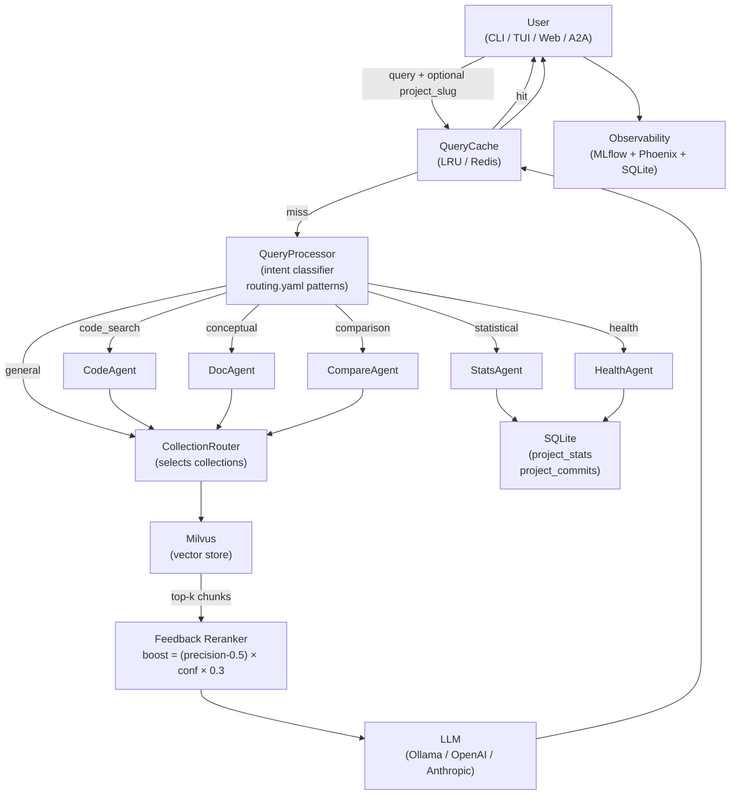
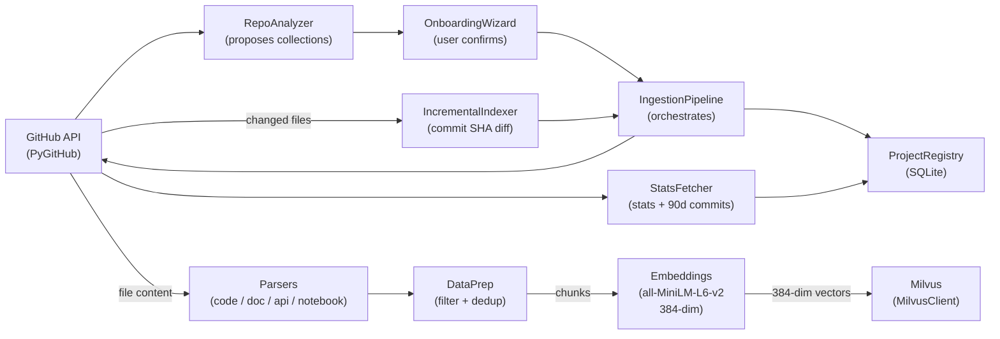
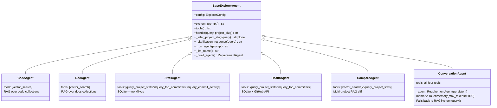
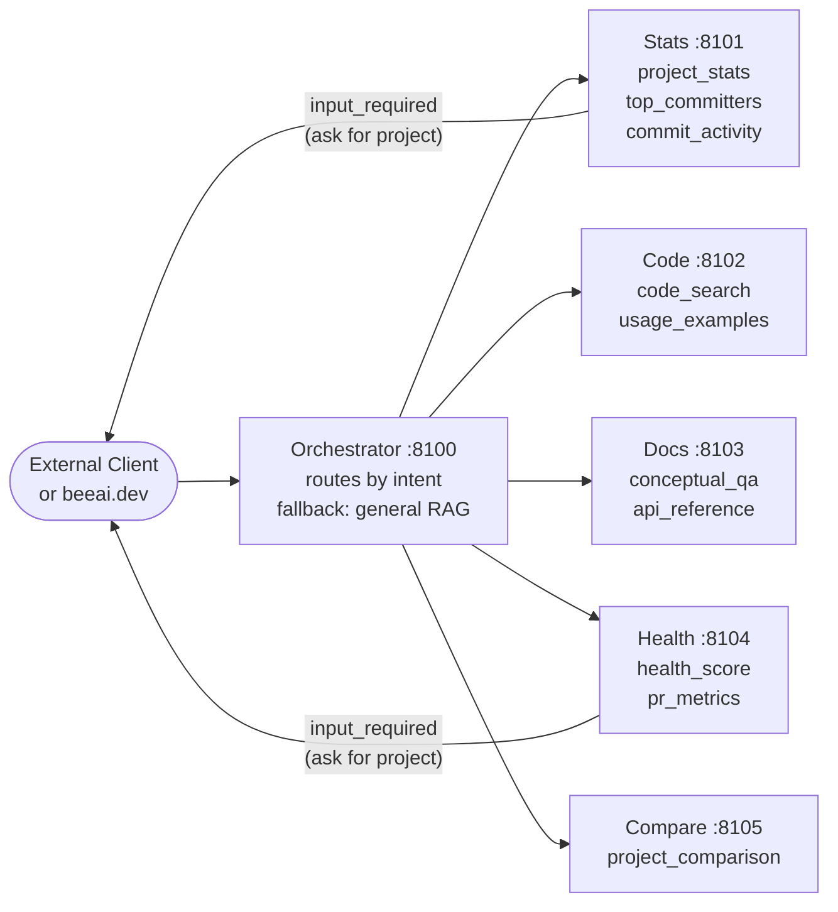
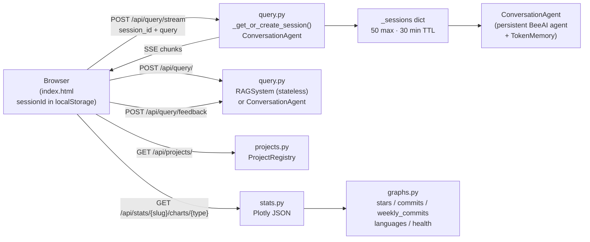

# Project Explorer — Architecture

## Overview

Project Explorer is a multi-agent RAG system that indexes GitHub repositories and provides a natural-language interface for exploring them. Queries are classified by intent and routed to specialized agents; each agent uses BeeAI `@tool`-decorated functions to retrieve from Milvus collections or SQLite, and generates responses via an LLM.

The system is a reference implementation of the agent pattern validated in [lfai/ML_LLM_Ops](https://github.com/lfai/ML_LLM_Ops), extended with BeeAI tool-based agents, multi-collection routing, incremental indexing, A2A agent endpoints, and a full observability stack.

---

## Interfaces

Five interfaces share the same backend — `RAGSystem.query()` / `RAGSystem.stream()` and the individual agents:

| Interface | Entry Point | Notes |
|---|---|---|
| CLI (one-shot) | `project-explorer ask` | `typer` + `rich` |
| CLI (interactive) | `project-explorer chat` | REPL with BeeAI `TokenMemory` conversation history |
| TUI | `project-explorer tui` | Textual full-screen app; streaming + cross-turn memory |
| Web UI | `project-explorer web` | FastAPI + HTML/JS; SSE streaming, session-based memory, Plotly charts |
| A2A | `project-explorer serve` | AgentStack SDK, one `Server` per agent |

---

## Query Flow



`RAGSystem` exposes two entry points:
- `query(query, project_slug)` — blocks until full response is ready; used by CLI, A2A, and session agents
- `stream(query, project_slug)` — synchronous generator yielding text chunks then a `{"_done": True, ...}` sentinel; used by TUI and web SSE endpoint

---

## Ingestion Flow



---

## Agent Architecture

### Class Hierarchy

All agents extend `BaseExplorerAgent`, which wraps BeeAI's `RequirementAgent`:



### ConversationAgent and Session Memory

`ConversationAgent` maintains a **single persistent `RequirementAgent` instance** across calls, backed by `TokenMemory(max_tokens=8000)`. Each turn is appended to memory so the LLM has full conversation context without manual history injection.

- **CLI `chat`** — one `ConversationAgent` lives for the duration of the session
- **TUI** — one `ConversationAgent` per app launch; streaming via `RAGSystem.stream()`, turn text fed back into BeeAI memory via `UserMessage`/`AssistantMessage` after each stream completes
- **Web UI** — session-based: a `ConversationAgent` is created on first request for a given `session_id` (browser UUID from `localStorage`), cached server-side for 30 minutes idle, max 50 concurrent sessions

### BeeAI Tools (`agents/tools.py`)

Agents use `@tool`-decorated functions. BeeAI's `RequirementAgent` calls tools iteratively (up to `max_iterations=20`) using the docstring as description and the function signature to generate the Pydantic schema.

| Tool | Used by | Description |
|---|---|---|
| `vector_search(query, collection_names)` | Code, Doc, Compare, Conversation | Searches Milvus across named collections |
| `query_project_stats(project_slug)` | Stats, Health, Compare, Conversation | Returns formatted stats from SQLite; commit counts prefer live `project_commits` data |
| `query_top_committers(project_slug, limit)` | Stats, Health, Conversation | Returns ranked contributor list (90d) from `project_commits` |
| `query_commit_activity(project_slug)` | Stats, Conversation | Returns weekly commit trend as text chart (last 12 weeks) |

### Project Inference and Clarification

`BaseExplorerAgent` provides two helpers used by all agents:

- `_infer_project_slug(query)` — scans the registry and returns a slug if the query text mentions a known project name or slug
- `_clarification_response(query)` — returns a natural-language question listing available projects when no slug can be inferred

The A2A layer mirrors this with the `input_required` pattern (see below). The TUI and web UI both detect the "Which project are you asking about?" prefix and enter clarification mode automatically.

### `_run_agent()` Async/Sync Bridge

`_run_agent()` handles the async/sync boundary:
- CLI context: calls `asyncio.run()` on the BeeAI coroutine
- Async context (FastAPI, TUI worker thread): uses a `ThreadPoolExecutor` to avoid blocking the event loop

Both `CodeAgent` and `DocAgent` fall back to direct `LLMBackend.complete()` if BeeAI is unavailable.

---

## A2A Agent Endpoints (AgentStack)

`project-explorer serve --all` starts six independently discoverable A2A servers using `agentstack-sdk`:



Default ports start at **8100** (not 8080) to avoid conflicts with common local services. Ports are consecutive: orchestrator at `base`, specialists at `base+1` through `base+5`.

Stats and Health use async generator functions with `yield TaskStatus(state=TaskState.input_required, ...)` — the server pauses and sends a question to the client, then resumes when the client replies with a project name.

Each external client can also call specialist agents directly by port, bypassing the orchestrator.

---

## Web UI

`project-explorer web` starts `explorer.web.app:app` (FastAPI) and serves a single-page HTML frontend from `explorer/web/static/index.html`.



### Session Memory

The browser generates a `crypto.randomUUID()` on first load and stores it in `localStorage` as `pe_session_id`. Every request sends this ID in the `session_id` field. The server maintains a module-level `_sessions` dict mapping session IDs to `(ConversationAgent, last_used_timestamp)` tuples. Sessions are evicted after 30 minutes idle or when the 50-session cap is hit (oldest evicted first).

### Streaming

`POST /api/query/stream` returns `Content-Type: text/event-stream`. The synchronous `RAGSystem.stream()` generator (or session `ConversationAgent.handle()`) runs in a daemon thread; results are pushed to an `asyncio.Queue` via `loop.call_soon_threadsafe()` and yielded to the client as SSE events:

- `{"t": "chunk", "v": "<text>"}` — one or more text fragments
- `{"t": "done", "intent": "...", "hash": "...", "cached": false, "chart": {...}}` — terminal event, includes optional Plotly figure JSON

### Charts

`graphs.py` provides five Plotly figure builders:

| Function | Chart type | Data source |
|---|---|---|
| `stars_over_time_plotly` | Line | `project_stats` snapshots |
| `commits_over_time_plotly` | Bar | `project_stats` snapshots (30d window per snapshot) |
| `weekly_commits_plotly` | Bar | `project_commits` (live per-commit data, last 13 weeks) |
| `language_breakdown_plotly` | Pie | `project_stats` latest row |
| `health_radar_plotly` | Radar | `project_stats` latest row |

`weekly_commits_plotly` is selected automatically when a query contains "week", "weekly", "per week", or "week-by-week". All five are available as sidebar chart tabs and via `GET /api/stats/{slug}/charts/{type}`.

The frontend uses:
- **Tailwind CSS** (CDN) for styling
- **marked.js** (CDN) for markdown rendering in chat bubbles
- **Plotly.js** (CDN) for interactive charts with dark-theme overrides

---

## Module Map

```mermaid
graph TD
    subgraph Interfaces
        cli_main["cli/main.py\nTyper app"]
        web_app["web/app.py\nFastAPI"]
        tui_app["tui/app.py\nTextual\n(streaming + memory)"]
        a2a["agentstack_server.py\nA2A (6 servers\nports 8100–8105)"]
    end

    subgraph Core
        rag["rag_system.py\nquery() + stream()"]
        qp["query_processor.py\nIntent classifier"]
        cr["collection_router.py\nCollection selector"]
        qc["query_cache.py\nLRU / Redis cache"]
        reg["registry.py\nProjectRegistry (SQLite)"]
    end

    subgraph Agents
        base["agents/base.py\nBaseExplorerAgent"]
        tools_file["agents/tools.py\n@tool functions"]
        code["agents/code_agent.py"]
        doc["agents/doc_agent.py"]
        stats["agents/stats_agent.py"]
        health["agents/health_agent.py"]
        compare["agents/compare_agent.py"]
        conv["agents/conversation_agent.py\npersistent RequirementAgent\n+ TokenMemory"]
    end

    subgraph WebRoutes
        qroute["web/routes/query.py\n_sessions dict\nSSE streaming"]
        proute["web/routes/projects.py"]
        sroute["web/routes/stats.py\n5 chart endpoints"]
    end

    subgraph Ingestion
        pipeline["ingestion/pipeline.py"]
        incremental["ingestion/incremental.py"]
        code_parser["ingestion/code_parser.py"]
        doc_parser["ingestion/doc_parser.py"]
        api_parser["ingestion/api_parser.py"]
        nb_parser["ingestion/notebook_parser.py"]
        data_prep["ingestion/data_prep.py"]
    end

    subgraph GitHub
        gh_client["github/client.py\nGitHubClient"]
        gh_analyzer["github/analyzer.py\nRepoAnalyzer"]
        gh_stats["github/stats_fetcher.py\nStatsFetcher\n(stats + 90d commits)"]
    end

    subgraph Storage
        store["multi_collection_store.py\nMilvus + feedback reranking"]
        embed["embeddings.py\nSentenceTransformer"]
        llm["llm_client.py\nLLMBackend\n(complete + stream)"]
    end

    subgraph Observability
        metrics["observability/metrics_collector.py"]
        phoenix["observability/phoenix_client.py"]
        mlflow_t["observability/mlflow_tracking.py"]
        feedback["observability/feedback_collector.py"]
    end

    cli_main & web_app & tui_app & a2a --> rag
    web_app --> qroute & proute & sroute
    qroute --> conv & rag
    rag --> qp & qc & cr & base
    base --> code & doc & stats & health & compare & conv
    base --> tools_file
    tools_file --> store & reg
    cr --> store
    store --> embed
    rag --> llm
    cli_main --> pipeline
    pipeline --> gh_client & code_parser & doc_parser & api_parser & nb_parser & data_prep & store
    incremental --> pipeline
    gh_stats --> reg
    rag --> metrics & phoenix & mlflow_t
```



---

## Collection Namespace Model

Each project gets its own Milvus collections, namespaced as `{project_slug}_{collection_type}`:

| Collection Type | Content | Chunk Size | Routed To |
|---|---|---|---|
| `python_code` | `.py` source | 512 / overlap 64 | CodeAgent |
| `javascript_code` | `.js/.ts` source | 512 / overlap 64 | CodeAgent |
| `java_code` | `.java` source | 512 / overlap 64 | CodeAgent |
| `go_code` | `.go` source | 512 / overlap 64 | CodeAgent |
| `markdown_docs` | READMEs, guides | 384 / overlap 48 | DocAgent |
| `web_docs` | HTML docs sites | 384 / overlap 48 | DocAgent |
| `api_reference` | OpenAPI specs | 256 / overlap 32 | DocAgent |
| `examples` | Notebooks, samples | 1024 / overlap 128 | CodeAgent |
| `pdfs` | PDFs via Docling | 512 / overlap 64 | DocAgent |
| `release_notes` | GitHub releases | 256 / overlap 32 | DocAgent |

`CollectionRouter` selects up to `RAG__MAX_COLLECTIONS_PER_QUERY` (default 3) collections per query based on the query text and requested project scope.

---

## SQLite Schema

The project registry (`~/.project-explorer/projects.db` by default) maintains three tables:

| Table | Purpose |
|---|---|
| `projects` | Project metadata: slug, display_name, github_url, status, collections, indexed_at |
| `project_stats` | GitHub stats snapshots: stars, forks, contributors, commits_30d, commits_90d, etc. |
| `project_commits` | 90-day commit history: sha, message, author_name, author_email, committed_at |

`project_commits` uses `UNIQUE(project_slug, sha)` with `INSERT OR IGNORE` for idempotent fetches. All commit count queries (30d, 90d, weekly) read from this table rather than the snapshot columns in `project_stats` — this ensures consistency between the count displayed in stats and the committer list.

---

## Key Design Decisions

### Intent Classification Before Retrieval

`QueryProcessor` classifies intent using regex patterns from `config/routing.yaml` before any Milvus call. Statistical and health queries never touch the vector store — they go directly to SQLite. This avoids unnecessary embedding + search for queries the vector store can't answer well.

### Cache Is the Highest-ROI Optimization

`QueryCache` sits at the entry point of `RAGSystem.query()`. Cache hits skip classification, retrieval, and LLM generation entirely. The default in-memory LRU (`max_size=1000`, `ttl=3600s`) is sufficient for most deployments; switch to Redis via `CACHE__BACKEND=redis` for multi-process deployments.

### Live Commit Counts Over Snapshots

`query_project_stats` and `StatsAgent` both prefer live counts from `project_commits` (computed with `committed_at >= cutoff` filters) over the snapshot values in `project_stats`. This eliminates the inconsistency where a stats query said "0 commits" while the committer list showed actual contributors.

### Session-Based Memory for Web UI

The web UI uses a `session_id` UUID (generated by `crypto.randomUUID()`, persisted in `localStorage`) to maintain a persistent `ConversationAgent` server-side. This gives the web UI the same cross-turn memory as the CLI and TUI without requiring server-side login or cookies. Sessions expire after 30 minutes idle; the server caps at 50 concurrent sessions (LRU eviction).

### Milvus Schema

Each collection uses a fixed 4-field schema: `id` (INT64, auto), `vector` (FLOAT_VECTOR 384-dim), `text` (VARCHAR), `metadata_json` (VARCHAR with JSON payload). Dynamic fields are disabled. This schema works with both Milvus Lite (`.db` file) and Milvus standalone/cloud. Index type is FLAT (compatible with Lite); change `index_type` in `_ensure_collection()` to `HNSW` for standalone at scale.

### Incremental Indexing

`IncrementalIndexer` compares the latest GitHub commit SHA against the last-indexed SHA in the project registry. If changed, it calls the GitHub compare API to get the diff file list, maps files to affected collections, drops those collections, and re-ingests them via `IngestionPipeline._ingest_collection()`. `refresh` always also calls `StatsFetcher.fetch()` to update commit history and GitHub metrics, unless `--no-stats` is passed.

### Observability Is Non-Blocking

MLflow experiment logging and Arize Phoenix traces are dispatched to daemon threads from `RAGSystem._track()`. They never block the response path. Both can be disabled via `OBSERVABILITY__MLFLOW__ENABLED=false` and `OBSERVABILITY__PHOENIX__ENABLED=false`.

---

## Extension Points

### Adding a New LLM Backend

1. Implement the `LLMBackend` protocol in `explorer/llm_client.py`:
   ```python
   class MyBackend:
       def complete(self, prompt: str, system: str = "", **kwargs) -> str: ...
       def stream(self, prompt: str, system: str = "", **kwargs) -> Iterator[str]: ...
   ```
2. Add a branch in `get_llm()` for your backend name.
3. Add config fields to `LLMConfig` in `explorer/config.py`.
4. Update `_llm_name()` in `BaseExplorerAgent` to return the BeeAI ChatModel name string.
5. Set `LLM__BACKEND=mybackend` in `.env`.

### Adding a New Collection Type

1. Add a `CollectionType` entry to `COLLECTION_TYPES` in `config/collection_config.py`.
2. Add a parser method to `IngestionPipeline` in `explorer/ingestion/pipeline.py` (or reuse an existing parser).
3. Add the collection name to the dispatch dict in `_ingest_collection()`.
4. Add routing logic to `CollectionRouter.select()` in `explorer/collection_router.py`.
5. Update `RepoAnalyzer._build_plan()` in `explorer/github/analyzer.py` to detect when to propose it.

### Adding a New Agent

1. Create `explorer/agents/my_agent.py` extending `BaseExplorerAgent`:
   ```python
   class MyAgent(BaseExplorerAgent):
       def system_prompt(self) -> str:
           return "You are a specialist in..."
       def tools(self) -> list:
           from explorer.agents.tools import vector_search
           return [vector_search]
       def handle(self, query: str, project_slug: str | None = None, **kwargs) -> str:
           slug = project_slug or self._infer_project_slug(query)
           if not slug:
               return self._clarification_response(query)
           return self._run_agent(f"Project: {slug}\n\nQuestion: {query}")
   ```
2. Add a new `QueryIntent` value to `explorer/query_processor.py`.
3. Add regex patterns to `config/routing.yaml`.
4. Add a routing branch in `RAGSystem._route()`.
5. Optionally add a new A2A `Server` factory in `explorer/agentstack_server.py`.

### Adding a New Intent Pattern

Edit `config/routing.yaml` — no code changes required. Patterns are `re.search()` with `re.IGNORECASE`. Use single-quoted YAML strings for patterns containing backslashes (e.g. `'\w+'`). Higher-priority intents should appear earlier in the file.

### Adding a BeeAI Tool

Add a `@tool`-decorated function to `explorer/agents/tools.py`:

```python
from beeai_framework.tools import tool

@tool(description="One-line description visible to the LLM.")
def my_tool(param: str) -> str:
    """Detailed description — used as the BeeAI tool description."""
    ...
```

Then return it from the relevant agent's `tools()` method. BeeAI generates the Pydantic schema from the function signature.

### Switching to Redis Cache

```bash
# Install
uv sync --extra redis

# Configure
CACHE__BACKEND=redis
CACHE__REDIS_URL=redis://localhost:6379/0
```

The Redis backend uses sets keyed as `pe:project:{slug}:keys` to track per-project entries for invalidation on refresh.

### Switching to a Remote Milvus / Zilliz Cloud

```bash
MILVUS__URI=https://your-cluster.zillizcloud.com
MILVUS__TOKEN=your_api_key
```

Change `index_type` in `MultiCollectionStore._ensure_collection()` from `"FLAT"` to `"HNSW"` for better performance at scale.
