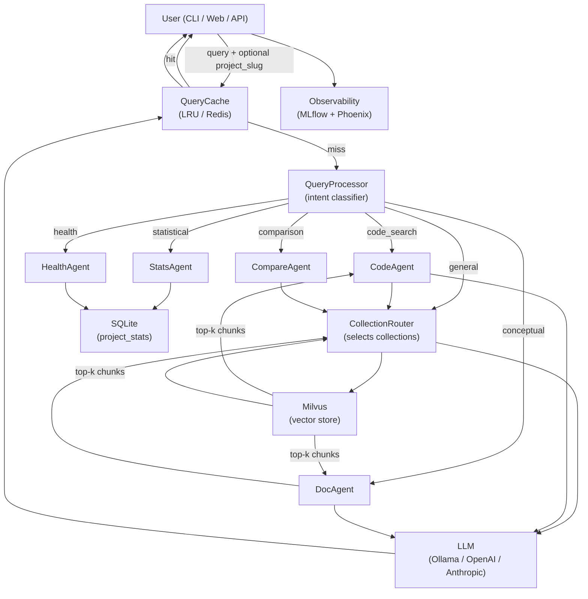
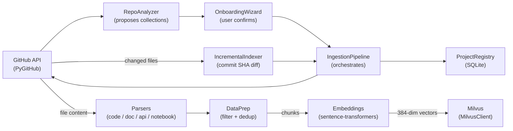
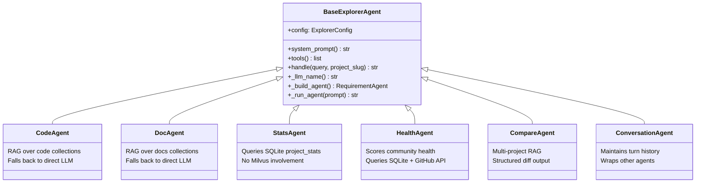

# Project Explorer — Architecture

## Overview

Project Explorer is a multi-agent RAG system that indexes GitHub repositories and provides a natural-language interface for exploring them. Queries are classified by intent and routed to specialized agents; each agent retrieves from a dedicated Milvus collection namespace and generates responses via an LLM.

The system is a reference implementation of the agent pattern validated in [lfai/ML_LLM_Ops](https://github.com/lfai/ML_LLM_Ops), extended with multi-collection routing, incremental indexing, and a full observability stack.

---

## Query Flow



---

## Ingestion Flow



---

## Module Map

```mermaid
graph TD
    subgraph CLI
        cli_main["cli/main.py\nTyper app"]
        cli_wizard["cli/wizard.py\nOnboarding"]
        cli_interactive["cli/interactive.py\nREPL"]
    end

    subgraph Core
        rag["rag_system.py\nOrchestrator"]
        qp["query_processor.py\nIntent classifier"]
        cr["collection_router.py\nCollection selector"]
        qc["query_cache.py\nLRU / Redis cache"]
        reg["registry.py\nProjectRegistry (SQLite)"]
    end

    subgraph Agents
        base["agents/base.py\nBaseExplorerAgent"]
        code["agents/code_agent.py"]
        doc["agents/doc_agent.py"]
        stats["agents/stats_agent.py"]
        health["agents/health_agent.py"]
        compare["agents/compare_agent.py"]
        conv["agents/conversation_agent.py"]
    end

    subgraph Ingestion
        pipeline["ingestion/pipeline.py"]
        incremental["ingestion/incremental.py"]
        code_parser["ingestion/code_parser.py"]
        doc_parser["ingestion/doc_parser.py"]
        api_parser["ingestion/api_parser.py"]
        nb_parser["ingestion/notebook_parser.py"]
        data_prep["ingestion/data_prep.py"]
    end

    subgraph GitHub
        gh_client["github/client.py\nGitHubClient"]
        gh_analyzer["github/analyzer.py\nRepoAnalyzer"]
        gh_stats["github/stats_fetcher.py\nStatsFetcher"]
    end

    subgraph Storage
        store["multi_collection_store.py\nMilvusClient wrapper"]
        embed["embeddings.py\nSentenceTransformer"]
        llm["llm_client.py\nLLMBackend"]
    end

    subgraph Observability
        metrics["observability/metrics_collector.py"]
        phoenix["observability/phoenix_client.py"]
        mlflow_t["observability/mlflow_tracking.py"]
        feedback["observability/feedback_collector.py"]
    end

    cli_main --> rag
    cli_main --> cli_wizard
    cli_main --> cli_interactive
    cli_interactive --> conv
    rag --> qp
    rag --> qc
    rag --> cr
    rag --> base
    base --> code
    base --> doc
    base --> stats
    base --> health
    base --> compare
    cr --> store
    store --> embed
    rag --> llm
    cli_wizard --> pipeline
    pipeline --> gh_client
    pipeline --> code_parser
    pipeline --> doc_parser
    pipeline --> api_parser
    pipeline --> nb_parser
    pipeline --> data_prep
    pipeline --> store
    incremental --> pipeline
    gh_stats --> reg
    rag --> metrics
    rag --> phoenix
    rag --> mlflow_t
```



---

## Collection Namespace Model

Each project gets its own Milvus collections, namespaced as `{project_slug}_{collection_type}`:

| Collection Type | Content | Chunk Size | Routed To |
|---|---|---|---|
| `python_code` | `.py` source | 512 / overlap 64 | CodeAgent |
| `javascript_code` | `.js/.ts` source | 512 / overlap 64 | CodeAgent |
| `java_code` | `.java` source | 512 / overlap 64 | CodeAgent |
| `go_code` | `.go` source | 512 / overlap 64 | CodeAgent |
| `markdown_docs` | READMEs, guides | 384 / overlap 48 | DocAgent |
| `web_docs` | HTML docs sites | 384 / overlap 48 | DocAgent |
| `api_reference` | OpenAPI specs | 256 / overlap 32 | DocAgent |
| `examples` | Notebooks, samples | 1024 / overlap 128 | CodeAgent |
| `pdfs` | PDFs via Docling | 512 / overlap 64 | DocAgent |
| `release_notes` | GitHub releases | 256 / overlap 32 | DocAgent |

`CollectionRouter` selects up to `RAG__MAX_COLLECTIONS_PER_QUERY` (default 3) collections per query based on the query text and requested project scope.

---

## Agent Architecture

All agents extend `BaseExplorerAgent`, which wraps BeeAI's `RequirementAgent`:



`_run_agent()` handles the async/sync boundary: it calls `asyncio.run()` from CLI contexts and uses a `ThreadPoolExecutor` when called from inside an async context (FastAPI). Both `CodeAgent` and `DocAgent` fall back to direct `LLMBackend.complete()` if BeeAI is unavailable.

---

## Key Design Decisions

### Intent Classification Before Retrieval

`QueryProcessor` classifies intent using regex patterns from `config/routing.yaml` before any Milvus call. Statistical and health queries never touch the vector store — they go directly to SQLite. This avoids unnecessary embedding + search for queries the vector store can't answer.

### Cache Is the Highest-ROI Optimization

`QueryCache` sits at the entry point of `RAGSystem.query()`. Cache hits skip classification, retrieval, and LLM generation entirely. The default in-memory LRU (`max_size=1000`, `ttl=3600s`) is sufficient for most deployments; switch to Redis via `CACHE__BACKEND=redis` for multi-process deployments.

### Milvus Schema

Each collection uses a fixed 4-field schema: `id` (INT64, auto), `vector` (FLOAT_VECTOR 384-dim), `text` (VARCHAR), `metadata_json` (VARCHAR with JSON payload). Dynamic fields are disabled. This schema works with both Milvus Lite (`.db` file) and Milvus standalone/cloud. Index type is FLAT (compatible with Lite); change `index_type` in `_ensure_collection()` to `HNSW` for standalone at scale.

### Incremental Indexing

`IncrementalIndexer` compares the latest GitHub commit SHA against the last-indexed SHA in the project registry. If changed, it calls the GitHub compare API to get the diff file list, maps files to affected collections, drops those collections, and re-ingests them via `IngestionPipeline._ingest_collection()`. This is called by `project-explorer refresh` and by the `/api/projects/{slug}/refresh` endpoint.

### Observability Is Non-Blocking

MLflow experiment logging and Arize Phoenix traces are dispatched to daemon threads from `RAGSystem._track()`. They never block the response path. Both can be disabled via `OBSERVABILITY__MLFLOW__ENABLED=false` and `OBSERVABILITY__PHOENIX__ENABLED=false`.

---

## Extension Points

### Adding a New LLM Backend

1. Implement the `LLMBackend` protocol in `explorer/llm_client.py`:
   ```python
   class MyBackend:
       def complete(self, prompt: str, system: str = "", **kwargs) -> str: ...
       def stream(self, prompt: str, system: str = "", **kwargs) -> Iterator[str]: ...
   ```
2. Add a branch in `get_llm()` for your backend name.
3. Add config fields to `LLMConfig` in `explorer/config.py`.
4. Update `_llm_name()` in `BaseExplorerAgent` to return the BeeAI ChatModel name string.
5. Set `LLM__BACKEND=mybackend` in `.env`.

### Adding a New Collection Type

1. Add a `CollectionType` entry to `COLLECTION_TYPES` in `config/collection_config.py`.
2. Add a parser method to `IngestionPipeline` in `explorer/ingestion/pipeline.py` (or reuse an existing parser).
3. Add the collection name to the dispatch dict in `_ingest_collection()`.
4. Add routing logic to `CollectionRouter.select()` in `explorer/collection_router.py`.
5. Update `RepoAnalyzer._build_plan()` in `explorer/github/analyzer.py` to detect when to propose it.

### Adding a New Agent

1. Create `explorer/agents/my_agent.py` extending `BaseExplorerAgent`:
   ```python
   class MyAgent(BaseExplorerAgent):
       def system_prompt(self) -> str:
           return "You are a specialist in..."
       def tools(self) -> list:
           return []  # or add BeeAI tools
       def handle(self, query: str, project_slug: str | None = None, **kwargs) -> str:
           # your logic here
           prompt = ...
           return self._run_agent(prompt)
   ```
2. Add a new `QueryIntent` value to `explorer/query_processor.py`.
3. Add regex patterns to `config/routing.yaml`.
4. Add a routing branch in `RAGSystem._route()`.

### Adding a New Intent Pattern

Edit `config/routing.yaml` — no code changes required. Patterns are `re.search()` with `re.IGNORECASE`. Higher-priority intents should appear earlier in the file.

### Switching to Redis Cache

```bash
# Install
uv sync --extra redis

# Configure
CACHE__BACKEND=redis
CACHE__REDIS_URL=redis://localhost:6379/0
```

The Redis backend uses sets keyed as `pe:project:{slug}:keys` to track per-project entries for invalidation on refresh.

### Switching to a Remote Milvus / Zilliz Cloud

```bash
MILVUS__URI=https://your-cluster.zillizcloud.com
MILVUS__TOKEN=your_api_key
```

Change `index_type` in `MultiCollectionStore._ensure_collection()` from `"FLAT"` to `"HNSW"` for better performance at scale.

### Adding BeeAI Tools

`BaseExplorerAgent.tools()` returns `[]` by default. To give an agent access to a tool:

```python
def tools(self) -> list:
    from beeai_framework.tools import SomeTool
    return [SomeTool(...)]
```

BeeAI's `RequirementAgent` will then call tools iteratively (up to `max_iterations=20`) before returning a final response.
